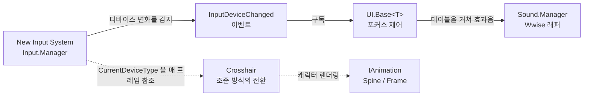
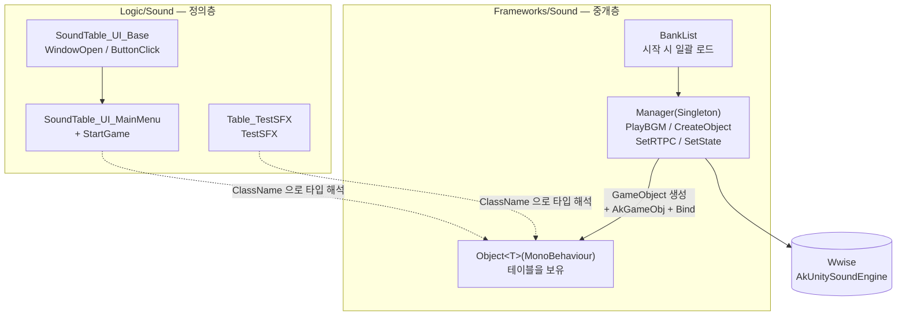
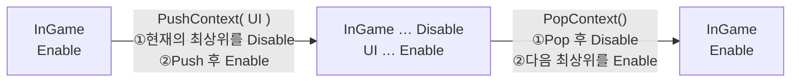
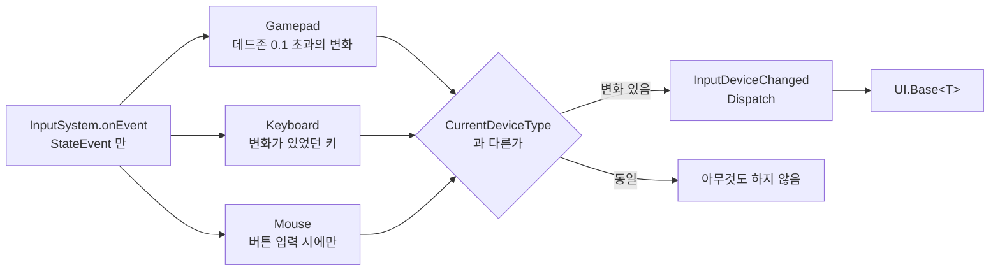
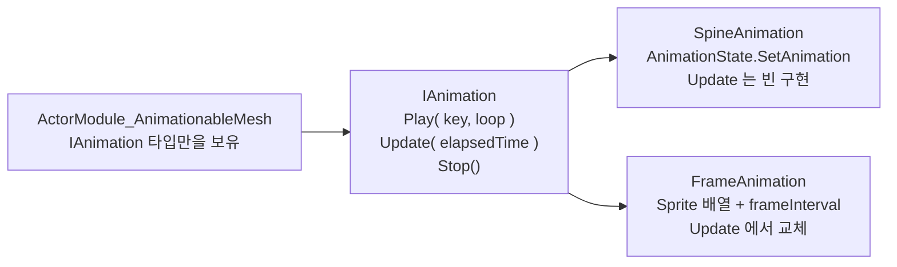
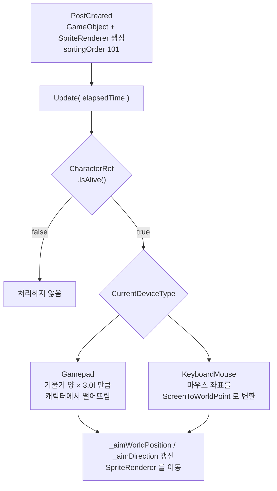

[日本語](README.md) | [한국어](README.ko.md)

# Kathedra Void | Unity 구현 포트폴리오

**Wwise 사운드 기반, New Input System의 컨텍스트 관리, 애니메이션 구현의 추상화를 시니어 엔지니어가 구축한 기존 프레임워크에 통합하는 역할을 담당했습니다.**

| 작품 | 팀·담당자 | 개발 환경 |
| --- | --- | --- |
| 2D 탑다운 익스트랙션 슈터<br/>『Kathedra Void』 | 프로그래머 2명<br/>(시니어 엔지니어 1명 / 본인 1명)<br/>유기현 / 62String | Unity 2022(URP) / C#<br/>Wwise·Spine<br/>New Input System·ScriptableObject |

## 게시 범위

- **제품 코드 17개 파일의 발췌**입니다. 공통 기반(`Foundations.Singleton`, `Event.Dispatcher`, `Resource.Manager` 등)·씬·Prefab·Wwise 뱅크는 포함되지 않으므로, 단독으로는 컴파일·실행할 수 없습니다.
- 게시 기준은 팀 리포지토리의 `main` 브랜치, 커밋 `059e82d` 시점입니다.
- `Scripts/` 이하는 원본 프로젝트의 `Program/Assets/Scripts/` 와 동일한 상대 경로 구성을 유지하고 있습니다.
- 재사용을 허가하는 라이선스는 설정하지 않았습니다.

---

## 담당 기능의 연결 관계



> 담당 기능 사이의 데이터 흐름을 나타낸 개요도입니다. 실선은 이벤트 구독, 점선은 참조를 나타냅니다.

---

## 담당 범위와 코드

| 기능 | 구현 포인트 | 소스 |
| --- | --- | --- |
| **사운드 기반** | Wwise API의 래퍼, 테이블 정의와 오브젝트 생성의 분리, 뱅크 일괄 로드 | [Manager](Scripts/Frameworks/Sound/Sound_Manager.cs) / [Object](Scripts/Frameworks/Sound/Sound_Object.cs) / [Table](Scripts/Frameworks/Sound/Sound_Table.cs) / [BankList](Scripts/Frameworks/Sound/Sound_BankList.cs) |
| **사운드 정의** | `Table_Base` 를 상속한 구체 테이블, `ClassName` 에 의한 타입 해석 | [UI_Base](Scripts/Logic/Sound/SoundTable_UI_Base.cs) / [UI_MainMenu](Scripts/Logic/Sound/SoundTable_UI_MainMenu.cs) / [TestSFX](Scripts/Logic/Sound/Table_TestSFX.cs) |
| **인풋** | ActionMap 스택을 통한 컨텍스트 전환, 입력 디바이스의 자동 판정 | [Manager](Scripts/UI/Input/Input_Manager.cs) / [EnumTypes](Scripts/UI/Input/Input_EnumTypes.cs) |
| **애니메이션 추상화** | Spine 과 프레임 애니메이션을 동일한 API로 교체 가능하게 하는 인터페이스 | [IAnimation](Scripts/Frameworks/Animation/IAnimation.cs) / [Spine](Scripts/Frameworks/Animation/SpineAnimation.cs) / [Frame](Scripts/Frameworks/Animation/FrameAnimation.cs) |
| **UI 기저·Tween** | 디바이스 종류에 따른 포커스 제어의 공통화, AnimationCurve 기반의 Tween | [UI_Base](Scripts/UI/UI_Base.cs) / [Alpha](Scripts/UI/Tweens/UI_TweenAlpha.cs) / [Color](Scripts/UI/Tweens/UI_TweenColor.cs) / [Rotate](Scripts/UI/Tweens/UI_TweenRotate.cs) |
| **크로스헤어** | Gamepad / KeyboardMouse 양쪽 대응 조준, 스틱의 기울기 양에 따른 거리 제어 | [Crosshair](Scripts/Logic/Controller/Controller_Crosshair.cs) |

---

## 사운드 시스템

Wwise 를 3개 레이어로 분리해, **소리의 추가가 테이블 작성만으로 완결되는** 구조로 만들었습니다.



| 클래스 | 역할 |
| --- | --- |
| `Sound_Manager` | Wwise API의 래퍼. BGM 재생·정지, 사운드 오브젝트 생성·파괴, RTPC·State의 조작 |
| `Sound_Object<T>` | 개별 사운드 테이블을 보유하는 MonoBehaviour |
| `Sound_Table` | 이벤트 이름을 모아둔 ScriptableObject의 기저 클래스 |
| `Sound_BankList` | 시작 시 일괄 로드하는 뱅크 리스트의 ScriptableObject |

### 문자열에 의한 타입 해석

테이블 측이 자신에 대응하는 `Object<T>` 의 타입명을 `ClassName` 으로 공개하고, Manager는 그것을 사용해 컴포넌트를 동적으로 생성합니다. **테이블을 하나 추가해도 Manager에는 손을 대지 않습니다.**

```csharp
var table = Resource.Manager.Instance.Load<T>(tablePath);

var go = new GameObject(table.name);
go.transform.SetParent(parent.transform);
go.AddComponent<AkGameObj>();

var type = Type.GetType(table.ClassName);
var soundObject = go.AddComponent(type) as Object<T>;

soundObject.Bind(table);
```

---

## 인풋 시스템

### ActionMap 스택

UI와 게임플레이에서 유효한 ActionMap을 전환할 때, 스택으로 직전의 컨텍스트를 보유해 **"UI를 닫으면 직전의 게임 입력으로 돌아간다"**는 전환을 구현했습니다.



```csharp
public void PushContext(ActionMapType type)
{
    if (_actionMapTable.TryGetValue(type, out InputActionMap map) == false)
    {
        Logger.Warning(LogCategory.System,
            "PushContext 실패 - ActionMapTable 에서 ActionMap을 찾지 못했다. ActionMapType:({0})", type);
        return;
    }

    if (_contextStack.Count > 0)
    {
        _contextStack.Peek().Disable();
    }
    _contextStack.Push(map);
    map.Enable();
}
```

`ActionMapType` enum을 순회해 ActionMap을 일괄 등록하기 때문에, 맵을 추가할 때 작성하는 코드는 enum에 한 줄뿐입니다.

### 디바이스 종류의 자동 판정

`InputSystem.onEvent` 를 구독해 **실제로 입력이 있었던 디바이스**를 판정합니다. 노이즈를 집어내지 않도록, 디바이스별로 다른 조건을 두었습니다.



마우스는 이동만으로는 판정하지 않고, **버튼을 눌렀을 때만** KeyboardMouse로 간주합니다. 패드 조작 중에 마우스가 조금 움직인 것만으로 포커스가 벗어나는 것을 방지하기 위해서입니다.

`UI.Base<T>` 는 이 이벤트를 구독해, Gamepad라면 기본 선택 오브젝트로 포커스를 옮기고(`EventSystem` 의 초기화 순서를 고려해 1프레임 대기), KeyboardMouse라면 선택을 해제합니다.

---

## 애니메이션 인터페이스

프로토타입 단계에서는 Spine과 프레임 애니메이션이 공존할 가능성이 있었습니다. 양쪽 모두 "재생·갱신·정지"라는 동일한 조작을 가지기 때문에, 인터페이스로 추상화해 **모듈 측이 애니메이션 종류를 의식하지 않는** 설계로 만들었습니다.



`SpineAnimation.Update` 가 빈 구현인 것은 Spine이 내부에서 갱신을 수행하기 때문입니다. 호출하는 쪽의 통일성을 우선해 일부러 인터페이스에 남겨두었습니다.

---

## 크로스헤어 시스템



Gamepad에서는 스틱의 **정규화한 방향**과 **기울기의 크기**를 나누어 다루고, 기울기가 얕을 때는 크로스헤어가 캐릭터 근처에, 깊게 기울이면 최대 `CROSSHAIR_DISTANCE` 까지 떨어지도록 하고 있습니다. 방향만 보고 거리를 고정하면, 약간의 기울기에도 크로스헤어가 최대 거리까지 날아가 버리기 때문입니다.

```csharp
if( _aimStickInput.sqrMagnitude > 0.01f )
{
    _aimDirection = _aimStickInput.normalized;
    float distance = _aimStickInput.magnitude * CROSSHAIR_DISTANCE;
    _aimWorldPosition = characterPosition + _aimDirection * distance;
}
```

KeyboardMouse에서는 마우스의 월드 좌표로 직접 따라가며, 캐릭터와의 차분에서 조준 방향을 구합니다. 생성·파괴는 `PostCreated` / `PreDestory` 에서 수행하고, `Frameworks.Controller.Base` 의 라이프사이클에 맡기고 있습니다.

---

## 설계상의 판단

### Sound의 3레이어 구조
사운드 이벤트 이름의 정의 위치·재생 처리·엔진 API를 분리함으로써, 소리의 추가가 테이블 작성만으로 완결되도록 했습니다.
레이어 구성은 직접 설계했고, 시니어 엔지니어의 코드 리뷰 피드백을 반영해 정리했습니다.

### ActionMap 스택 방식
스택으로 직전의 컨텍스트를 보유하는 방식의 채택·구현은 본인이 수행했습니다.

### IAnimation 인터페이스의 도입
인터페이스의 구성은 시니어 엔지니어의 조언을 받으며 직접 설계했습니다.

### Wwise의 통합
Wwise의 채택은 시니어 엔지니어의 설계 방침에 따릅니다. Wwise Unity Integration의 환경 구축·동작 검증·기존 코드로의 마이그레이션 작업은 본인이 담당했습니다.

### Foundations / Main의 분리(참고)
순수 C#의 유틸리티 레이어(Foundations)와 Unity 의존의 구현 레이어(Main)를 나누는 구성은 시니어 엔지니어의 설계 방침에 따릅니다. 본인이 담당한 스크립트도 이 방침에 맞춰 배치했습니다.

---

## 기술 검증

### Wwise Unity Integration
Wwise SDK의 Unity 통합 절차를 조사·검증하고, Mac / Windows 양쪽 환경에서의 동작을 확인했습니다.
`AkUnitySoundEngine` 의 초기화 타이밍·뱅크 로드의 순서·BGM 오브젝트의 생존 관리(`DontDestroyOnLoad`)를 구현·검증한 뒤 `Sound_Manager` 에 통합했습니다.

---

## 배운 것

- **책무의 분리** — Sound의 Manager / Object / Table을 처음에는 한 클래스에 몰아넣고 있었지만, 코드 리뷰에서 "생성·조작·정의를 나눌 것"이라는 지적을 받아 리팩터링했습니다. 분할 후에는 각 클래스의 변경 이유가 명확해지고, 테이블을 추가할 때 Manager를 건드리지 않아도 되는 구성이 되었습니다.
- **인터페이스의 입도** — `IAnimation.Update` 에 `elapsedTime` 을 넘기는 설계에 대해, "Spine처럼 외부가 갱신하는 경우에도 빈 구현으로 통일할 수 있다"는 피드백을 받아, 호출하는 쪽의 통일성을 우선하는 판단을 배웠습니다.
- **기존 아키텍처의 준수** — 시니어 엔지니어가 구축한 Event Dispatcher·Command·ModeRule 등의 구조를 읽어내면서 자신의 코드를 통합하는 경험을 통해, 설계 의도를 파악한 뒤 구현하는 습관이 생겼습니다.

---

## 참여 기간

**2026년 2월 15일 ~ 2026년 5월 11일(약 3개월)**

프로젝트 리포지토리의 시작 단계부터 참여해, UI·인풋·사운드·애니메이션의 각 기반을 담당했습니다. 시니어 엔지니어는 중간부터 합류했기 때문에, 리포지토리의 초기 구축은 본인이 수행했습니다.
