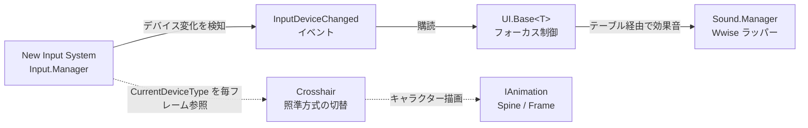
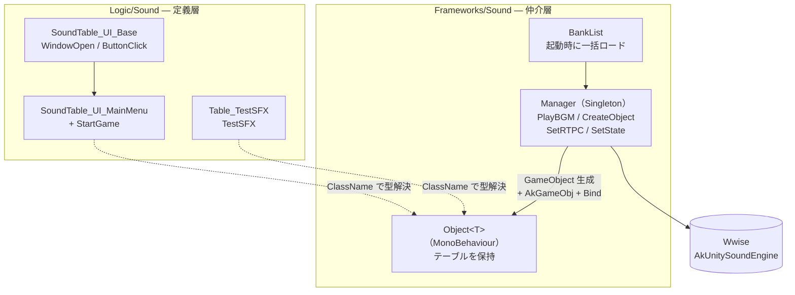
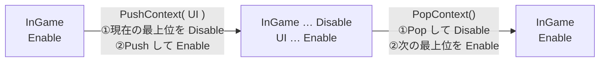
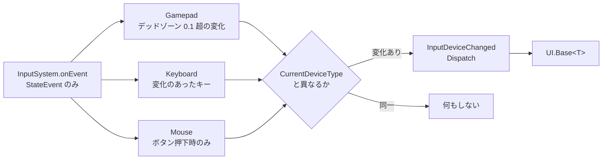
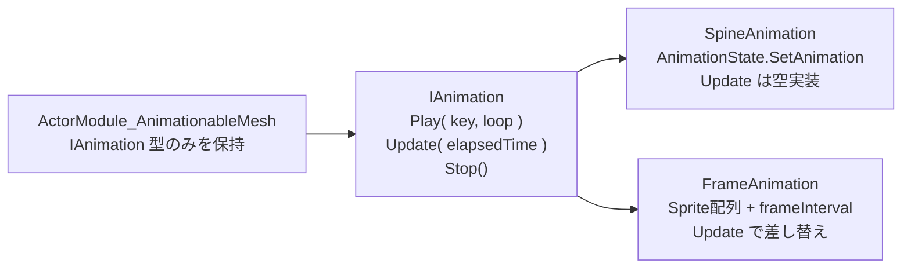
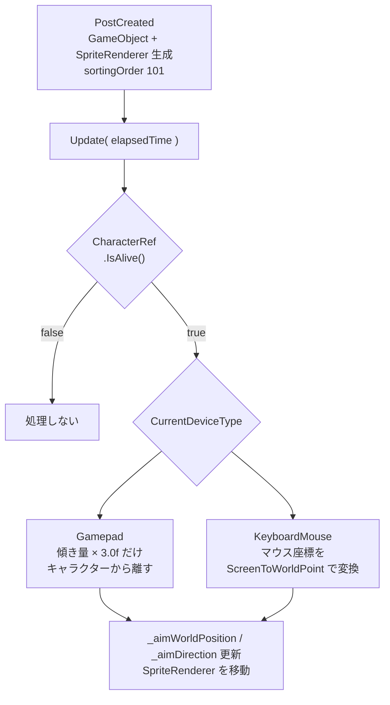

# Kathedra Void | Unity実装ポートフォリオ

**Wwise のサウンド基盤、New Input System のコンテキスト管理、アニメーション実装の抽象化を、シニアエンジニアが構築した既存フレームワークに組み込む役割を担当しました。**

| 作品 | チーム・担当者 | 開発環境 |
| --- | --- | --- |
| 2D トップダウン エクストラクション シューター<br/>『Kathedra Void』 | プログラマー2名<br/>（シニアエンジニア1名 / 自分1名）<br/>ユ・キヒョン / 62String | Unity 2022（URP）/ C#<br/>Wwise・Spine<br/>New Input System・ScriptableObject |

## 掲載範囲

- **製品コード17ファイルの抜粋**です。共通基盤（`Foundations.Singleton`、`Event.Dispatcher`、`Resource.Manager` 等）・シーン・Prefab・Wwise バンクは含まないため、単体ではコンパイル・実行できません。
- 掲載基準はチームリポジトリの `main` ブランチ、コミット `059e82d` 時点です。
- `Scripts/` 以下は元プロジェクトの `Program/Assets/Scripts/` と同じ相対パス構成を維持しています。
- 再利用を許諾するライセンスは設定していません。

---

## 担当機能のつながり



> 担当機能どうしのデータの流れを示した概要図です。実線はイベント購読、破線は参照を表します。

---

## 担当範囲とコード

| 機能 | 実装のポイント | ソース |
| --- | --- | --- |
| **サウンド基盤** | Wwise API のラッパー、テーブル定義とオブジェクト生成の分離、バンク一括ロード | [Manager](Scripts/Frameworks/Sound/Sound_Manager.cs) / [Object](Scripts/Frameworks/Sound/Sound_Object.cs) / [Table](Scripts/Frameworks/Sound/Sound_Table.cs) / [BankList](Scripts/Frameworks/Sound/Sound_BankList.cs) |
| **サウンド定義** | `Table_Base` を継承した具体テーブル、`ClassName` による型解決 | [UI_Base](Scripts/Logic/Sound/SoundTable_UI_Base.cs) / [UI_MainMenu](Scripts/Logic/Sound/SoundTable_UI_MainMenu.cs) / [TestSFX](Scripts/Logic/Sound/Table_TestSFX.cs) |
| **インプット** | ActionMap スタックによるコンテキスト遷移、入力デバイスの自動判定 | [Manager](Scripts/UI/Input/Input_Manager.cs) / [EnumTypes](Scripts/UI/Input/Input_EnumTypes.cs) |
| **アニメーション抽象化** | Spine とフレームアニメーションを同一 API で差し替え可能にするインターフェース | [IAnimation](Scripts/Frameworks/Animation/IAnimation.cs) / [Spine](Scripts/Frameworks/Animation/SpineAnimation.cs) / [Frame](Scripts/Frameworks/Animation/FrameAnimation.cs) |
| **UI 基底・Tween** | デバイス種別に応じたフォーカス制御の共通化、AnimationCurve ベースの Tween | [UI_Base](Scripts/UI/UI_Base.cs) / [Alpha](Scripts/UI/Tweens/UI_TweenAlpha.cs) / [Color](Scripts/UI/Tweens/UI_TweenColor.cs) / [Rotate](Scripts/UI/Tweens/UI_TweenRotate.cs) |
| **クロスヘア** | Gamepad / KeyboardMouse 両対応の照準、スティックの傾き量に応じた距離制御 | [Crosshair](Scripts/Logic/Controller/Controller_Crosshair.cs) |

---

## サウンドシステム

Wwise を 3 レイヤーに分離し、**音の追加がテーブルの記述だけで完結する**構造にしました。



| クラス | 役割 |
| --- | --- |
| `Sound_Manager` | Wwise API のラッパー。BGM 再生・停止、サウンドオブジェクト生成・破棄、RTPC・State の操作 |
| `Sound_Object<T>` | 個別のサウンドテーブルを保持する MonoBehaviour |
| `Sound_Table` | イベント名をまとめた ScriptableObject の基底クラス |
| `Sound_BankList` | 起動時に一括ロードするバンクリストの ScriptableObject |

### 文字列による型解決

テーブル側が自分に対応する `Object<T>` の型名を `ClassName` として公開し、Manager はそれを使ってコンポーネントを動的に生成します。**テーブルを1つ追加しても Manager には手を入れません。**

```csharp
var table = Resource.Manager.Instance.Load<T>(tablePath);

var go = new GameObject(table.name);
go.transform.SetParent(parent.transform);
go.AddComponent<AkGameObj>();

var type = Type.GetType(table.ClassName);
var soundObject = go.AddComponent(type) as Object<T>;

soundObject.Bind(table);
```

---

## インプットシステム

### ActionMap スタック

UI とゲームプレイで有効な ActionMap を切り替える際、スタックで直前のコンテキストを保持し、**「UI を閉じたら直前のゲーム入力に戻る」**遷移を実現しました。



```csharp
public void PushContext(ActionMapType type)
{
    if (_actionMapTable.TryGetValue(type, out InputActionMap map) == false)
    {
        Logger.Warning(LogCategory.System,
            "PushContext 실패 - ActionMapTable 에서 ActionMap을 찾지 못했다. ActionMapType:({0})", type);
        return;
    }

    if (_contextStack.Count > 0)
    {
        _contextStack.Peek().Disable();
    }
    _contextStack.Push(map);
    map.Enable();
}
```

`ActionMapType` enum を走査して ActionMap を一括登録するため、マップ追加時の記述は enum への1行のみで済みます。

### デバイス種別の自動判定

`InputSystem.onEvent` を購読し、**実際に入力があったデバイス**を判定します。ノイズを拾わないよう、デバイスごとに異なる条件を設けています。



マウスは移動だけでは判定せず、**ボタン押下時のみ** KeyboardMouse とみなします。パッド操作中にマウスが少し動いただけでフォーカスが外れるのを防ぐためです。

`UI.Base<T>` はこのイベントを購読し、Gamepad ならデフォルト選択オブジェクトへフォーカスを移し（`EventSystem` の初期化順を考慮して1フレーム待機）、KeyboardMouse なら選択を解除します。

---

## アニメーションインターフェース

プロトタイプ段階では Spine とフレームアニメーションが共存する可能性がありました。どちらも「再生・更新・停止」という同じ操作を持つため、インターフェースで抽象化し、**モジュール側がアニメーション種別を意識しない**設計にしました。



`SpineAnimation.Update` が空実装なのは、Spine が内部で更新を行うためです。呼び出し側の統一性を優先し、あえてインターフェースに残しています。

---

## クロスヘアシステム



Gamepad ではスティックを**正規化した方向**と**傾きの大きさ**を分けて扱い、傾きが浅いときはクロスヘアがキャラクターの近くに、深く倒すと最大 `CROSSHAIR_DISTANCE` まで離れるようにしています。方向だけを見て距離を固定すると、わずかな傾きでもクロスヘアが最遠に飛んでしまうためです。

```csharp
if( _aimStickInput.sqrMagnitude > 0.01f )
{
    _aimDirection = _aimStickInput.normalized;
    float distance = _aimStickInput.magnitude * CROSSHAIR_DISTANCE;
    _aimWorldPosition = characterPosition + _aimDirection * distance;
}
```

KeyboardMouse ではマウスのワールド座標へ直接追従し、キャラクターとの差分から照準方向を求めます。生成・破棄は `PostCreated` / `PreDestory` で行い、`Frameworks.Controller.Base` のライフサイクルに委ねています。

---

## 設計上の判断

### Sound の 3 レイヤー構造
サウンドイベント名の定義場所・再生処理・エンジン API を分離することで、音の追加がテーブルの記述だけで完結するようにしました。
レイヤー構成は自分で設計し、シニアエンジニアのコードレビューのフィードバックを反映して整理しています。

### ActionMap スタック方式
スタックで直前のコンテキストを保持する方式の採用・実装は自分が行いました。

### IAnimation インターフェースの導入
インターフェースの構成はシニアエンジニアのアドバイスを受けながら自分で設計しました。

### Wwise の統合
Wwise の採用はシニアエンジニアの設計方針に基づきます。Wwise Unity Integration の環境構築・動作検証・既存コードへのマイグレーション作業は自分が担当しました。

### Foundations / Main の分離（参考）
純粋 C# のユーティリティ層（Foundations）と Unity 依存の実装層（Main）を分ける構成はシニアエンジニアの設計方針に基づきます。自分の担当スクリプトもこの方針に沿って配置しました。

---

## 技術検証

### Wwise Unity Integration
Wwise SDK の Unity への組み込み手順を調査・検証し、Mac / Windows 両環境での動作を確認しました。
`AkUnitySoundEngine` の初期化タイミング・バンクロードの順序・BGM オブジェクトの生存管理（`DontDestroyOnLoad`）を実装・検証したうえで `Sound_Manager` に組み込んでいます。

---

## 学んだこと

- **責務の分離** — Sound の Manager / Object / Table を最初は1クラスに詰め込んでいましたが、コードレビューで「生成・操作・定義を分けること」の指摘を受けリファクタリングしました。分割後は各クラスの変更理由が明確になり、テーブル追加の際に Manager を触らずに済む構成になりました。
- **インターフェースの粒度** — `IAnimation.Update` に `elapsedTime` を渡す設計について、「Spine のように外部が更新するケースでも空実装で統一できる」というフィードバックをもらい、呼び出し側の統一性を優先する判断を学びました。
- **既存アーキテクチャへの準拠** — シニアエンジニアが構築した Event Dispatcher・Command・ModeRule 等の仕組みを読み解きながら自分のコードを組み込む経験を通じて、設計意図を把握したうえで実装する習慣がつきました。

---

## 参加期間

**2026年2月15日 〜 2026年5月11日（約3か月）**

プロジェクトリポジトリの立ち上げから参加し、UI・インプット・サウンド・アニメーションの各基盤を担当しました。シニアエンジニアは途中から合流したため、リポジトリの初期構築は自分が行っています。
